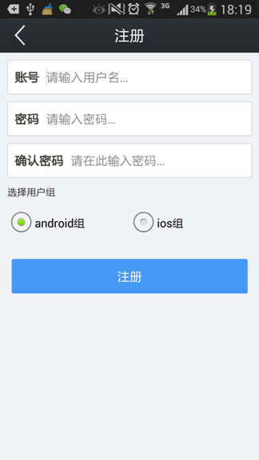
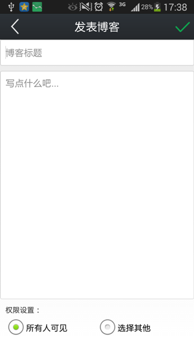
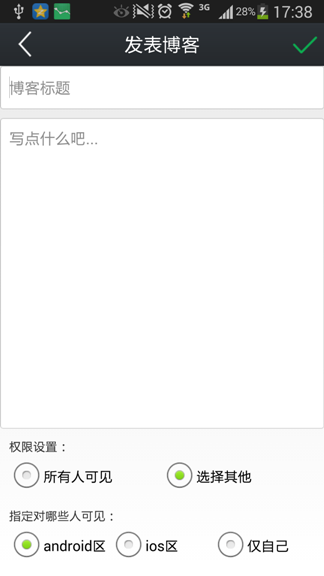
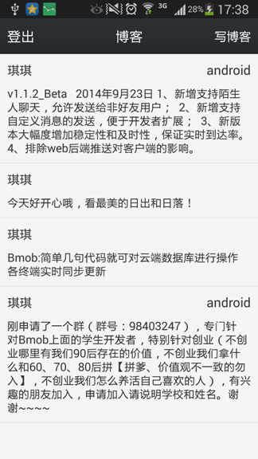

# Bmob Android ACL案例

## 案例场景

任何用户都可以登录进去发布博客，如下图所示。

注册时需要确定自己到底是Android还是iOS分组，如下图所示。

登录进入主界面之后，可以发布博客，发布博客时可以选择发布的博客到底是所有人可见，还是指定用户组的人可见，如下图所示。

发布成功之后就可以看到博客拉！

## Bmob官方信息

官方网址：[http://www.bmob.cn](http://www.bmob.cn)

问答社区：[http://wenda.bmob.cn](http://wenda.bmob.cn)

技术邮箱：support@bmob.cn